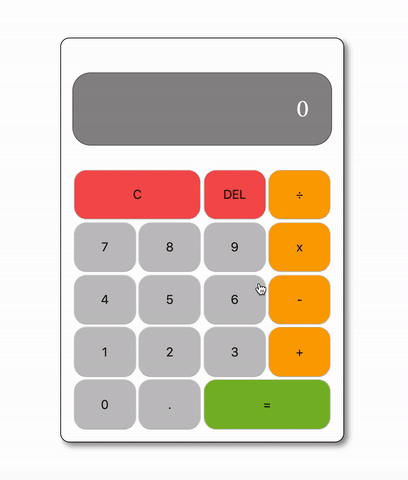

# JavaScript Basic Calculator

> Final result

## Overview

The purpose of this activity is to build a basic calculator using vanilla JavaScript. It allows basic mathematical operations such as addition, subtraction, multiplication and division.

User can make a single calculation as well as consecutive calculations and clear everything or delete a single digit.

Finally, if user enters only the first operand, chooses an operator and then hits equal, result is calculated based on that first operando. For example, an input of `6 + =` would result in `12` and one of `6 * =` would result in `36`.
